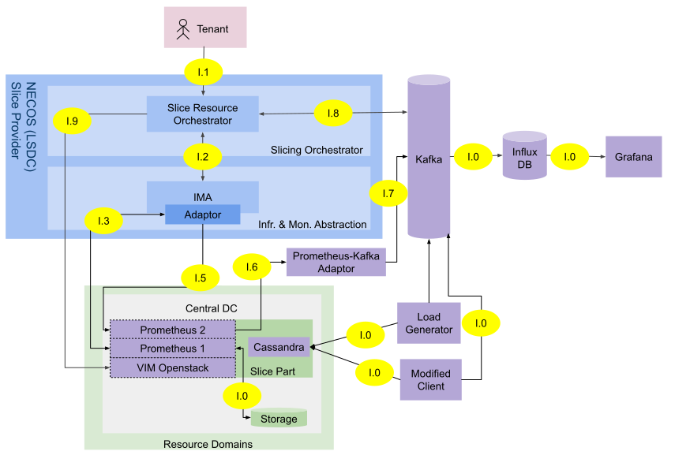

# Introduction to MLO (Machine Learning Based Orchestration)
## What can you expect from MLO once installed

**Introduction by Pasquini**

## Functional components
The picture bellow shows the architecture of this demo. The NECOS components implemented here are the SRO (Slice Resource Orchestrator) 
and the Infrastructure Monitoring Abstraction (IMA), in blue. To support this implementation, third part software components are 
used (purple). The arrows show the interaction among the components, using HTTP endpoints.



The interactions using the interfaces labeled with *I.O* are indepent of the main flow. Before a slice flavor model be created, each flavor goes through a profilling phase. In this phase, the 
service running inside the slice is loaded by a **Load Generator**, while a **Modified Client** collects end user's services KPIs, and the **Prometheus 1** instance collects
all the infrastructure metrics available, keeping them in a local **Storage**. This data is going to be used to feed the SRO in order to create an Machine
Learning Model, that shapes the behavor of the infrastructure during the probing time.

A flow to create a slice flavor model happens as follows:
1. The Tenant requests to the SRO to create a slice flavor model, passing the metrics collected by the Modified Client, called *Y File* (using the 
interface **I.1**).
2. The SRO requests the IMA to select the most relevant *K*, a natural number greater than 0, metrics of the infrastructure to train the flavor model,
also passing the *Y File* (**I.2**).
3. The IMA requests Prometheus 1 all the collected metrics to perform the feature selection (**I.3**). 
4. After performing the feature selection, the IMA will return to the *K* selected metrics in a .csv file (**I.2**).
5. The SRO trains a model that represents that flavor, under the given load.

Once created each flavor model, the forecast of the service KPI happens in this fashion:
1. The Tenant requests using **I.1** the forecast to start.
2. The SRO requests the IMA to send real time measurements of the *K* metrics (**I.2**).
3. The IMA requests the Prometheus 2 to send the measurements to Kafka (**I.4**, **I.5**, and **I.6**).
4. The SRO consumes the real time data, in order to forecast the KPI 30s in future (**I.7**).
5. The SRO publishes the forecasted values to Kafka, to be shown in Grafana.
5. If the orchestration was requested by the Tenant, the SRO may perform actions in the infrastructure 
to keep the selected KPI in conformance (**I.8**).

## Structure of the repository (software components)
Main directories:
1. FeatureSelectProject: Keeps the code that does the feature selection.
2. IMA: Holds the related IMA code.
3. Kafka Producer: Holds code to produce messags to the Kafka. Used in the Modified Client and Loadgenerator.
4. Loadgen: Keeps the code related with the Loadgen component that creates load to the Cassandra Service. It can be modified
to generate load to other kind of applications.
5. ReceiveConfigMap: Keeps the code resposible to change the Prometheus monitored metrics.
6. SRO: Keeps the code related with the SRO functions.
7. kafka-influxdb: Project adapted to consume information from Kafka topic and store to Influxdb, to be shown in Grafana. (forked from: [https://github.com/mre/kafka-influxdb](https://github.com/mre/kafka-influxdb))
8. raspberry_pi_cluster: Contains auxiliar codes to run tasks like csv's processing, Kubernetes and Prometheus configurations.

# How to install MLO

## Required general purpose hardware and software
Software and versions:
1. Ubuntu 16.4
2. Python version: 3.5.2
3. Kafka version: 2.11-2.0.0 
4. Zookeeper-3.4.12
5. Cassandra version: 3.11.3
6. Prometheus version: 2.2.1
7. Kubernetes: 1.11.0

Obs.: One machine can host all the modules showed above, but is recommended at least one for each. Also, depending of which 
workflow is executed: to create the flavor model of existing X and Y files, just the SRO module is needed. 

## Step by step installation procedure
To install this DEMO:
1. Clone the source code of this repository in the machine(s) that is(are) going to be: the (1) SRO, the (2)IMA, the  (3)Modified Cassandra Client,
the (4)Load Generator, the (5)Granafa dashboard, the (6)Prometheus Machine, and the (7)Cassandra Service Host(s).
```
$ git clone https://gitlab.com/necos/elasticity-demo-ufu.git
```

2. Inside the repository directory, run in each machine:
```
$ pip3 install -r requirements.txt
```

3. Install Grafana:
[https://grafana.com/docs/installation/debian/](https://grafana.com/docs/installation/debian/)

4. Install InfluxDB:
[https://docs.influxdata.com/influxdb/v1.7/introduction/installation/](https://docs.influxdata.com/influxdb/v1.7/introduction/installation/)

5. Connect your Grafana to your InfluxDB, following the official instructions:
[https://grafana.com/docs/features/datasources/influxdb/](https://grafana.com/docs/features/datasources/influxdb/)

6. Create a Kafka cluster: 
[https://kafka.apache.org/quickstart](https://kafka.apache.org/quickstart)

7. Create a Cassandra cluster:
[http://cassandra.apache.org/doc/latest/getting_started/installing.html](http://cassandra.apache.org/doc/latest/getting_started/installing.html)

8. On each Cassandra cluster machine, install node_exporter [https://github.com/prometheus/node_exporter](https://github.com/prometheus/node_exporter)

9. Set up the corresponding IPs inside the file SRO/config.py: IMA_IP, SRO_SERVER_HOST, and KAFKA_ENDPOINT.

10. Create a Kubernetes Cluster [https://kubernetes.io/docs/setup/production-environment/tools/kubeadm/create-cluster-kubeadm/](https://kubernetes.io/docs/setup/production-environment/tools/kubeadm/create-cluster-kubeadm/)

11. On kubernetes master, run ReceiveConfigMapController.py by running 
```
$ python ReceiveConfigMapController.py
```
12. Run prometheus-kafka adaptor in some machine [https://github.com/Telefonica/prometheus-kafka-adapter](https://github.com/Telefonica/prometheus-kafka-adapter)

13. Start a prometheus container on kubernetes cluster.

14. On IMA/Constants.py update constant KUBERNETES_MASTER_URL with kubernetes master's ip. You may update SLICE_FILES_DIR too.

15. On IMA/SliceConfig.py update "promURL" to prometheus' URL, "promNamespace" to prometheus container's namespace, "metadataName" to metadata you configure in prometheus files, urlToWrite" to prometheus-kafka-adaptor's URL, and "targets" with IP's where your service is running.

16. Put IMA/scripts content in your PATH or move the content to a directory that is already on PATH.

17. On IMAController.py at "main" function update "host" to host's IP.

# Running MLO

## Auxiliar services:
1. To Kafka exporters to InfluxDB, run the script:
```
$ ./run_influx_producers.sh
```

2. Run Grafana as a service:
```
$ sudo service grafana-server start
```

3. Run the Load Generator, feeling the variables accordlying with the load needed:
```
$ ./apache-cassandra-3.11.3/tools/run_loadgen_and_kafka_exporter.sh $DURATION_TOTAL $SINUSOID_PERIOD $LAMBDA $INITIAL_NUMBER_CLIENTS
```

4. Run the Modified Client:
```
$ ./cassandra/tools/run_client_and_kafka_exporter.sh $DURATION_TOTAL $LAMBDA $INITIAL_NUMBER_CLIENTS $NUMBER_THREADS
```

5. Certify if the Kafka and Cassandra clusters are running as services, otherwise consult the official
documentation to start them.

## Main modules:

1. Run the SRO server:
```
$ python3 sro_server.py
```

2. Run the IMA server: ...
```
$ python3 IMAController.py 
```

## The SRO services avaliable:
1. Example of a curl request to create a slice flavor model:
```
curl --noproxy 192.168.0.121 -X POST "http://192.168.0.121:13131/slice/{sliceId}/flavor/{flavorId}/profile?url_to_answer={callbackEndpoint}&sla_metric_name={kpi}&timestamp_label={timestampField}" -H "Content-Type: multipart/form-data" -F "file=@{yFile.csv}"
```

2. To request the KPI real time forecast:
```
curl -X POST http://192.168.0.121:13131/slice/{sliceId}/start_sla_forecast
```

3. To request the start of the orchestration:
```
curl -X POST http://192.168.0.121:13131/slice/{sliceId}/start_orchestration
```

## The IMA services available:
1. Example of a http request to extract data from a certain slice:
```
POST IMA_IP:5000/ymetrics/{sliceId}
body:
    files:
        YFile: csv containing service metrics. First column must be timestamp.
    form:
        callbackURL: URL to call after extraction and feature selection are completed.
        K: number of features to select
        sliceFlavor: ID of slice flavor
        YField {optional}: Name of field that will be used to do the selection. If not passed, IMA will assume that the csv's second column is the metric to be used.
```

2. Example of a http request to execute slice flavor change:
```
POST /elasticity/slice/{sliceId}/flavor/{sliceFlavorId}
```
